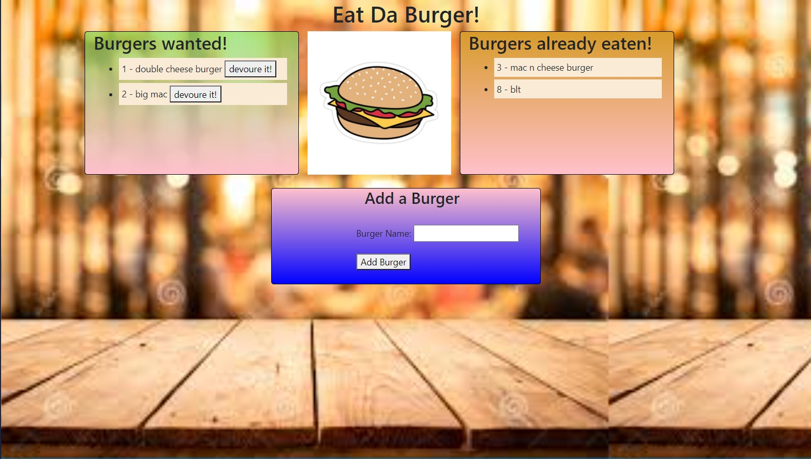

# Eat-Da-Burger
Burger logger with MySQL, Node, Express, Handlebars and a homemade ORM (yum!).

# Table of Content
- [Overview](#overview)
- [Directory Structure](#directory-structure)
- [Links](#links)
    - [Heroku Deployement](#heroku-deployement)
    - [Github Repo](#github-repo)
- [Screen Shot](#screen-shot)


# Overview
Create a burger logger with MySQL, Node, Express, Handlebars and a homemade ORM (yum!). Be sure to follow the MVC design pattern; use Node and MySQL to query and route data in your app, and Handlebars to generate your HTML.

# Directory Structure
```diff  
+├── \config
 │   ├── connection.js  
 │   └── orm.js  
 │   
+├── \controllers  
 │   └── burgers_controller.js  
 │  
+├── \db  
 │   ├── schema.sql  
 │   └── seeds.sql  
 │  
+├── \models  
 │   └── burger.js  
 │   
+├── \node_modules  
 │   
 ├── package.json  
 │  
+├── \public  
+│   └── \assets  
+│       ├── \css  
 │       │   └── style.css  
+│       ├── \image
 │       │   ├── AppScreenShot.jpg 
 │       │   ├── background.jpg
 │       │   └── burgerIcon.jpg
+│       └── \js
 │           └── burgers.js  
 │             
 ├── server.js  
 │  
+├── \views  
+    ├── index.handlebars  
+    ├── \layouts  
     │   └── main.handlebars  
+    └── \partials\burgers  
         └── burger-block.handlebars
```
# Links
## Heroku Deployement
[Heroku](https://eatdaburgerunc.herokuapp.com)
## Github Repo
[Github](https://github.com/nhounhou/Eat-Da-Burger)

# Screen Shot
